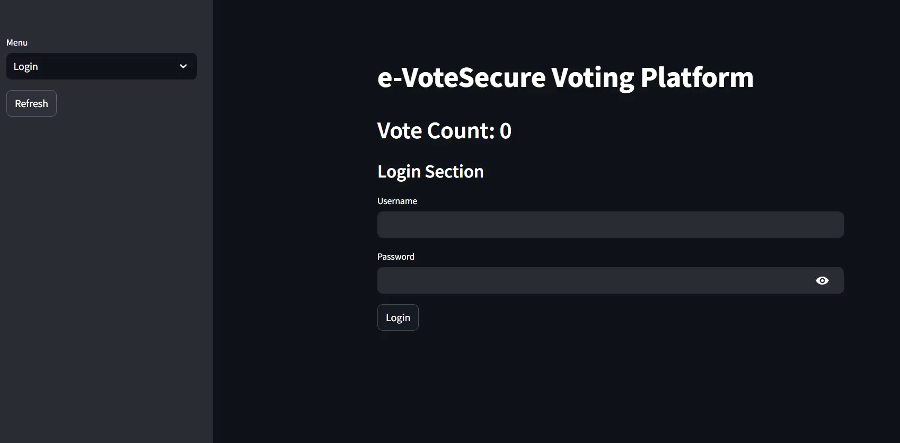
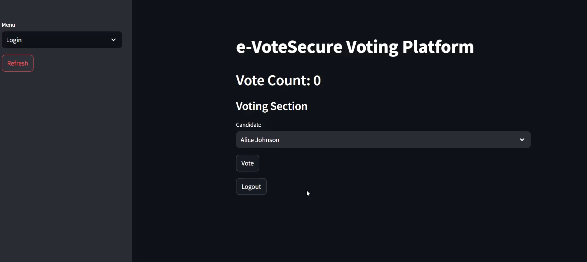
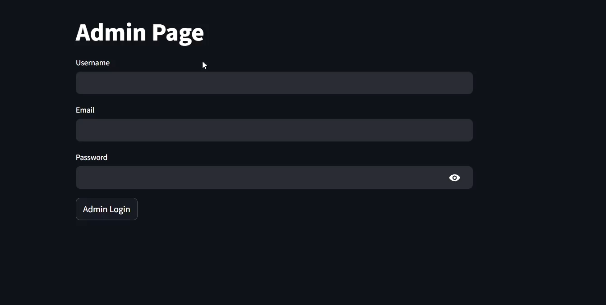
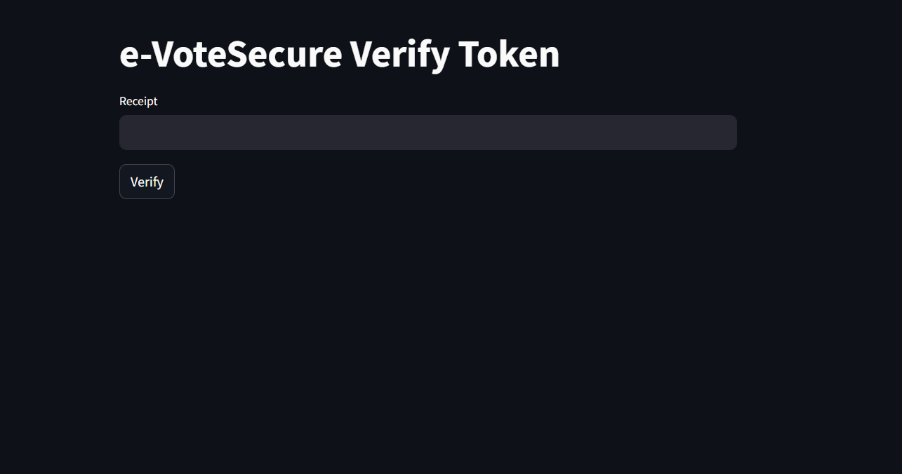
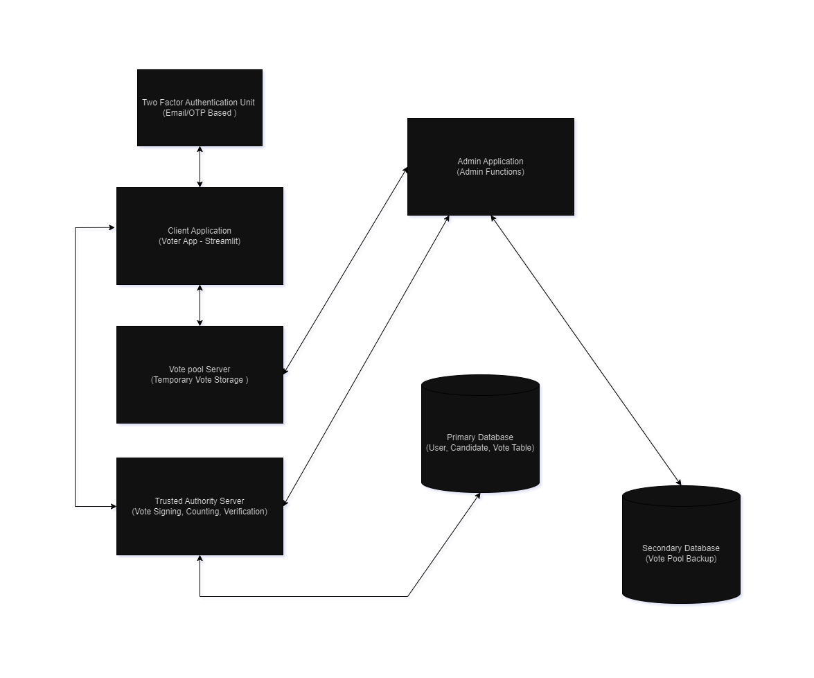

# e-VoteSecure - Implementation Report

## Code Listings
The `src` directory in this repository contains the code for the implementation of e-VoteSecure application. The `src` folder is structured as follows:

```
src
├── client                 # The client application for voting
├── trustedAuthority       # The trusted Authority server
├── votePool               # Server for the vote pooling service
├── db                     # Database helper functions 
├── utils                  # Utility functions
```

Note - Two factor authentication is implemented for all login and registration functionalities. The user receives an OTP via email to verify their identity. This verification is done to ensure that the user is the owner of the entered account and also for the user to verify that he/she is has reached the correct website to enter his/her vote.

### Client Application
The client application is a web application that allows voters to cast their votes. The client application is built using python and streamlit library and is located in the `src/client` directory. The code for the client application is as follows:

- `app.py`: The main file for the client application that contains the streamlit application code.

```python
import streamlit as st
import uuid
from datetime import datetime
from db.connection import get_db_connection
from db.voters import set_voted_in_db, get_voted_voters_from_db, get_user_from_db
from db.candidates import get_candidates_from_db
from client.users import (
    authenticate_user,
    register_new_user,
    verify_new_user,
    send_login_email,
)
from utils.helpers import find_large_prime
from client.crypto import blind_vote, unblind_signature
from client.config import (
    trusted_authority_sign_url,
    trusted_authority_verify_url,
    vote_pool_vote_count,
    Vote_pool_vote_submit_url,
    trusted_authority_get_token_url,
)
import requests

# Initialize
if "connection" not in st.session_state:
    st.session_state.connection = get_db_connection()

if "loggedInUser" not in st.session_state:
    st.session_state.loggedInUser = None

if "token" not in st.session_state:
    st.session_state.token = None

if "voted" not in st.session_state:
    st.session_state.voted = False

if "candidates" not in st.session_state:
    st.session_state.candidates = get_candidates_from_db(st.session_state.connection)

if "verifyUser" not in st.session_state:
    st.session_state.verifyUser = False


# Login section
def login():
    st.subheader("Login Section")

    username = st.text_input("Username")
    password = st.text_input("Password", type="password")

    if st.button("Login"):
        user = authenticate_user(username, password, st.session_state.connection)

        if user:
            token = requests.post(
                url=trusted_authority_get_token_url,
                json={"username": username},
            )

            if token.status_code == 200:
                # Send login email
                send_login_email(user["email"], username)
                st.success(f"User Logged In Successfully")
                st.session_state.loggedInUser = user
                st.session_state.token = token.json()["token"]
                st.session_state.k = find_large_prime(32)

            else:
                st.error("Login Failed")

    return


# Register user
def register():
    st.subheader("Register Section")

    username = st.text_input("Username")
    email = st.text_input("Email")
    password = st.text_input("Password", type="password")

    if st.button("Register"):
        st.session_state.verifyUser = verify_new_user(
            username, email, st.session_state.connection
        )

    if st.session_state.verifyUser:
        # Enter OTP
        entered_otp = st.text_input("Enter OTP")
        if st.button("Verify OTP"):
            if int(entered_otp) == st.session_state.otp:
                register_new_user(
                    username, email, password, st.session_state.connection
                )
                st.success("User registered successfully")

            else:
                st.error("Invalid OTP")


def logout():
    if st.button("Logout"):
        st.session_state.loggedInUser = None
        st.session_state.token = None
        st.session_state.voted = False
        st.session_state.k = None
        st.session_state.signed_vote = None
        st.session_state.receipt = None
        st.session_state.verifyUser = False
        st.success("Successfully logged out")
    return


# Voting section
def vote():
    st.subheader("Voting Section")

    candidates = st.session_state.candidates
    candidate_names = [candidate["candidate"] for candidate in candidates]
    candidate = st.selectbox("Candidate", candidate_names)
    user = get_user_from_db(
        st.session_state.loggedInUser["username"], st.session_state.connection
    )
    voted_status = user["voted"]

    if st.button("Vote") and voted_status == 0:
        # Blind the vote
        m = candidates[candidate_names.index(candidate)]["id"]
        m1 = blind_vote(st.session_state.k, m)

        # Sign the blinded vote -- Done by a trusted authority
        # Send a request to the trusted authority to sign the vote
        payload = {
            "blinded_vote": m1,
            "username": st.session_state.loggedInUser["username"],
        }

        response = requests.post(
            headers={"Authorization": f"Bearer {st.session_state.token}"},
            url=trusted_authority_sign_url,
            json=payload,
        )

        # Attempt to parse JSON if status code is OK
        if response.status_code == 200:
            try:
                signed_vote = response.json()["signed_vote"]

                # Submit the unblinded vote to the vote pool
                vote = unblind_signature(signed_vote, st.session_state.k)
                nonce = uuid.uuid4().hex
                timestamp = datetime.now().strftime("%Y-%m-%d_%H-%M-%S")
                unique_id = f"{nonce}_{timestamp}"
                payload = {"id": unique_id, "signed_vote": vote}

                # Make a POST request to the vote_submit API
                response_vote_pool = requests.post(
                    Vote_pool_vote_submit_url, json=payload
                )

                # Check the response status code
                if response_vote_pool.status_code == 200:
                    # If the vote is added successfully, return the receipt
                    receipt = response.json()["receipt"]
                    # Update the voted status of the user in the database
                    set_voted_in_db(
                        st.session_state.loggedInUser["username"],
                        st.session_state.connection,
                    )
                    st.session_state.signed_vote = signed_vote
                    st.session_state.receipt = receipt
                    st.session_state.voted = True
                    st.info("Copy the receipt to verify your vote")
                    st.code(receipt, language="bash")

                    st.success(f"Successfully voted for {candidate}")
                    get_vote_count()
                    st.session_state.voted_voters = get_voted_voters_from_db(
                        st.session_state.connection
                    )

                    return {"message": "Vote added successfully", "receipt": receipt}

                else:
                    # If there was an error adding the vote, return the error message
                    return {
                        "message": response_vote_pool.json().get(
                            "message", "Unknown error"
                        )
                    }

            except ValueError:
                print("Error decoding JSON response")
        else:
            st.error("Error signing the vote")
            return


# Verify vote
def verify_vote():
    st.subheader("Verify Vote")

    receipt = st.text_input("Receipt")
    if st.button("Verify"):
        payload = {
            "receipt": int(receipt),
            "user_id": st.session_state.loggedInUser["id"],
        }

        response = requests.post(
            headers={"Authorization": f"Bearer {st.session_state.token}"},
            url=trusted_authority_verify_url,
            json=payload,
        )

        if response.status_code == 200:
            st.success("Vote verified successfully")
        else:
            st.error("Failed to verify vote")


def get_vote_count():
    response = requests.get(url=vote_pool_vote_count)
    if response.status_code == 200:
        vote_count = response.json()["vote_count"]
        st.session_state.vote_count = vote_count
    return vote_count


# Streamlit app layout
st.title("e-VoteSecure Voting Platform")

# Get the vote count from the trusted authority
if "vote_count" not in st.session_state:
    st.session_state.vote_count = get_vote_count()
st.header(f"Vote Count: {st.session_state.vote_count}")

menu = ["Login", "Register"]
choice = st.sidebar.selectbox("Menu", menu)
refrest = st.sidebar.button("Refresh")

if not st.session_state.loggedInUser:
    if choice == "Login":
        login()
    else:
        register()
else:
    if not st.session_state.voted:
        vote()
    else:
        verify_vote()

    logout()

# Display the voted voters
if "voted_voters" not in st.session_state:
    st.session_state.voted_voters = get_voted_voters_from_db(
        st.session_state.connection
    )

voted_voters = {voter["username"] for voter in st.session_state.voted_voters}

if voted_voters:
    st.subheader("Voted Voters")
    st.write(voted_voters)
```

- `admin.py`: Contains the functions for the admin panel to request to migrate votes and start counting

```python
# Admin page where admin can request for vote count to start
import streamlit as st
from db.connection import get_db_connection
from db.candidates import get_candidates_from_db
from config import (
    trusted_authority_get_token_url,
    vote_pool_vote_migrate_url,
    trusted_authority_vote_count_url,
)
from trustedAuthority.trustedAuthority_votePool import (
    set_vote_uncounted_in_db,
)
from users import send_otp
from dotenv import load_dotenv
import os
import random
import requests

# Database connection
if "connection" not in st.session_state:
    st.session_state.connection = get_db_connection()

# Admin details
load_dotenv()

ADMIN_USER = os.getenv("ADMIN_USER")
ADMIN_PASSWORD = os.getenv("ADMIN_PASSWORD")

if "otp" not in st.session_state:
    st.session_state.otp = None

if "admin" not in st.session_state:
    st.session_state.admin = False

if "token" not in st.session_state:
    st.session_state.token = None

if "votes_migrated" not in st.session_state:
    st.session_state.votes_migrated = False

if "results_in" not in st.session_state:
    st.session_state.results_in = False


def admin_page():
    username = st.text_input("Username")
    email = st.text_input("Email")
    password = st.text_input("Password", type="password")

    if st.button("Admin Login"):
        if username == ADMIN_USER and password == ADMIN_PASSWORD:
            # Generate OTP
            otp = random.randint(100000, 999999)

            if send_otp(email, otp):
                st.session_state.otp = otp

        else:
            st.error("Invalid credentials")
            return

    if st.session_state.otp:
        entered_otp = st.text_input("Enter OTP")
        if st.button("Verify OTP"):
            if int(entered_otp) == st.session_state.otp:
                token = requests.post(
                    trusted_authority_get_token_url,
                    json={"username": username, "password": password},
                )
                st.session_state.token = token.json()["token"]
                st.session_state.otp = None
                st.session_state.admin = True
                st.success("Admin logged in successfully")
            else:
                st.error("Invalid OTP")


def migrate_votes():
    st.subheader("Migrate Votes")
    if st.button("Migrate Votes"):
        response = requests.post(
            url=vote_pool_vote_migrate_url,
            headers={"Authorization": f"Bearer {st.session_state.token}"},
        )

        if response.status_code == 200:
            st.success("Votes migrated successfully")
            st.session_state.votes_migrated = True
        else:
            st.error("Votes migration failed")


def vote_counting():
    st.session_state.results_in = False
    st.subheader("Vote Counting")
    st.write("Admin logged in")

    st.write("Request for Vote counting")
    if st.button("Request Vote Counting"):
        response = requests.post(
            trusted_authority_vote_count_url,
        )

        if response.status_code == 200:
            st.success("Vote counting has finished")
            st.session_state.results_in = True
        else:
            st.error("Vote counting request failed")


def print_end_result():
    # Display the list of candidates and their votes
    candidates = get_candidates_from_db(st.session_state.connection)
    st.header("Candidates")

    for candidate in candidates:
        st.write(f"{candidate['candidate']} - Vote Count: {candidate['vote_count']}")


st.title("Admin Page")

if not st.session_state.admin:
    admin_page()
else:
    if st.session_state.votes_migrated:
        st.write("Votes have been migrated")
        # Display both vote counting and vote migration buttons separately
        vote_counting()
    else:
        migrate_votes()

    if st.session_state.results_in:
        print_end_result()
```

- `users.py`: Contains the functions for user authentication and registration.

```python
import bcrypt
import streamlit as st
from db.voters import get_user_from_db, set_user_in_db

import random
import smtplib
from dotenv import load_dotenv
import os
from email.mime.text import MIMEText
from email.mime.multipart import MIMEMultipart

# Load environment variables
load_dotenv()

# Email settings from environment variables
EMAIL_HOST = os.getenv("EMAIL_HOST")
EMAIL_PORT = os.getenv("EMAIL_PORT")
EMAIL_USER = os.getenv("EMAIL_USER")
EMAIL_PASSWORD = os.getenv("EMAIL_PASSWORD")


# Send OTP via email
def send_otp(email, otp):
    try:
        msg = MIMEMultipart()
        msg["From"] = EMAIL_USER
        msg["To"] = email
        msg["Subject"] = "Your OTP for Registration"

        body = f"Your OTP for registration is {otp}. Please enter it to complete your registration."
        msg.attach(MIMEText(body, "plain"))

        server = smtplib.SMTP(EMAIL_HOST, EMAIL_PORT)
        server.starttls()
        server.login(EMAIL_USER, EMAIL_PASSWORD)
        server.sendmail(EMAIL_USER, email, msg.as_string())
        server.quit()

        st.success("OTP sent successfully")
        return True
    except Exception as e:
        st.error(f"Failed to send email: {e}")
        return False


# Send Login email
def send_login_email(email, username):
    try:
        msg = MIMEMultipart()
        msg["From"] = EMAIL_USER
        msg["To"] = email
        msg["Subject"] = "Login Activity"

        body = f"You just logged in to the voting system as {username}."
        msg.attach(MIMEText(body, "plain"))

        server = smtplib.SMTP(EMAIL_HOST, EMAIL_PORT)
        server.starttls()
        server.login(EMAIL_USER, EMAIL_PASSWORD)
        server.sendmail(EMAIL_USER, email, msg.as_string())
        server.quit()

        st.success("Login email sent successfully")

    except Exception as e:
        st.error(f"Failed to send email: {e}")
        return False


# Check if user exists and password is correct
def authenticate_user(username, password, connection):
    try:
        user = get_user_from_db(username, connection)

        if user:
            print("User found, checking password")
            password_match = bcrypt.checkpw(
                password.encode("utf-8"), user["password"].encode("utf-8")
            )
            print(f"Password match: {password_match}")

            if password_match:
                if user["voted"]:
                    raise Exception("Already Voted")
                else:
                    return user
            else:
                raise Exception("Invalid username or password")

        raise Exception("User not found")

    except Exception as e:
        print(f"Error: {e}")
        st.error(e)
        return None


def register_new_user(username, email, password, connection):
    try:
        # Hash password
        hashed_password = bcrypt.hashpw(
            password.encode("utf-8"), bcrypt.gensalt()
        ).decode("utf-8")

        print(email)

        # Insert user into database
        set_user_in_db(username, email, hashed_password, connection)
        st.session_state.verifyUser = False
        st.session_state.otp = None
        return True

    except Exception as e:
        st.error(f"Failed to verify OTP: {e}")
        return False


def verify_new_user(username, email, connection):
    try:
        # Check if user already exists
        user = get_user_from_db(username, connection)
        if user:
            raise Exception("User already exists")

        # Generate OTP
        otp = random.randint(100000, 999999)

        if send_otp(email, otp):
            st.session_state.otp = otp
            return True

    except Exception as e:
        st.error(f"Failed to register user: {e}")
        return False
```

- `crypto.py`: Contains the functions for cryptographic operations such as blinding and unblinding votes.

```python
from utils.helpers import modular_exponentiation, extended_gcd
from client.config import trusted_authority_public_key_url
import requests

# Get the public key from the trusted authority
response = requests.get(trusted_authority_public_key_url)
if response.status_code == 200:
    public_key = response.json()["public_key"]
    e, n = public_key
else:
    print("Error getting public key from trusted authority")
    exit(1)


def blind_vote(k, m):
    # Generate blinding factor
    bf = modular_exponentiation(k, e, n)
    print("Blinding factor:", bf)

    # Blinding the message
    m1 = (m * bf) % n
    print("Blinded message:", m1)
    return m1


def unblind_signature(s, k):
    # Unblind the signature
    s2 = (s * extended_gcd(k, n)[1]) % n
    print("Unblinded signature:", s2)
    return s2
```

- `config.py`: Contains the configuration settings for the client application.

### Database

The `db` directory contains the database helper functions for interacting with the database. The database helper functions are as follows:

- `connection.py`: Contains the function to establish a connection to the database.

```python
import pymysql
from dotenv import load_dotenv
import os

load_dotenv()

HOST = os.getenv("DB_HOST")
PORT = os.getenv("DB_PORT")
USER = os.getenv("DB_USER")
PASSWORD = os.getenv("DB_PASSWORD")


def get_db_connection(db_name="defaultdb"):
    timeout = 10
    connection = pymysql.connect(
        charset="utf8mb4",
        connect_timeout=timeout,
        cursorclass=pymysql.cursors.DictCursor,
        db=db_name,
        host=HOST,
        password=PASSWORD,
        read_timeout=timeout,
        port=int(PORT),
        user=USER,
        write_timeout=timeout,
        autocommit=True,
    )

    return connection


# Setup main database
def setup_primary_db():
    try:
        connection = get_db_connection()
        print(connection)
        cursor = connection.cursor()
        cursor.execute(
            "DROP TABLE IF EXISTS users, candidates, election_deparment_vote_table;"
        )
        cursor.execute(
            """CREATE TABLE users (
                    id INT AUTO_INCREMENT PRIMARY KEY,      -- Unique identifier for each user
                    username VARCHAR(50) NOT NULL UNIQUE,   -- Username field (must be unique)
                    email VARCHAR(50) NOT NULL,             -- Email field
                    password VARCHAR(255) NOT NULL,         -- Password field to store the hashed password
                    voted BOOLEAN DEFAULT FALSE             -- Boolean field to track if the user has voted (default is FALSE)
                );"""
        )

        cursor.execute(
            """CREATE TABLE candidates (
                    id INT AUTO_INCREMENT PRIMARY KEY,       -- Unique identifier for each candidate
                    candidate VARCHAR(100) NOT NULL,         -- Name of the candidate
                    vote_count INT DEFAULT 0                 -- Vote count, starting at 0
                );"""
        )
        cursor.execute(
            """CREATE TABLE election_deparment_vote_table (
                id INT AUTO_INCREMENT PRIMARY KEY,
                signed_vote TEXT NOT NULL,
                counted BOOLEAN DEFAULT FALSE             -- Boolean field to track if the vote was counted (default is FALSE)
            );"""
        )
    finally:
        connection.close()


# Setup secondary database
def setup_secondary_db():
    try:
        connection = get_db_connection("secondarydb")
        print(connection)
        cursor = connection.cursor()
        cursor.execute("DROP TABLE IF EXISTS vote_pool;")
        cursor.execute(
            """CREATE TABLE vote_pool (
                unique_id VARCHAR(52) PRIMARY KEY,
                signed_vote TEXT
            );"""
        )
    finally:
        connection.close()


# Insert values to database
def insert_values():
    try:
        connection = get_db_connection()
        cursor = connection.cursor()
        cursor.execute(
            """INSERT INTO users (username, email, password) VALUES 
                ('user1', 'cmggun456@gmail.com', '$2y$10$AWjxBjwFBtV9jYGu4u5KoeYXQCkbXOQgEWMHEwjK2fMBfCnRokcGq'), -- Password: password123
                ('user2', 'cmggun456@gmail.com', '$2y$10$nKyTtUOStl0Pfc4lNh9jhucwdgl8tcx6ZL23k0x7I4AVK5e/m/G3u'), -- Password: mypassword
                ('user3', 'cmggun456@gmail.com', '$2y$10$DBqVuyJ3b9eufW8Fkuic2eaIJ6FJcboRgcwWHSL2MwJWUnP7O9U36'); -- Password: secretpass
            """
        )
        cursor.execute("SELECT * FROM users WHERE username='user1'")
        print(cursor.fetchall())

        cursor.execute(
            """INSERT INTO candidates (candidate, vote_count) VALUES 
                ('Alice Johnson', 0),
                ('Bob Smith', 0),
                ('Carol Lee', 0),
                ('David Brown', 0),
                ('Eve Davis', 0);"""
        )
        cursor.execute("SELECT * FROM candidates")
        print(cursor.fetchall())

    finally:
        connection.close()


if __name__ == "__main__":
    setup_primary_db()
    setup_secondary_db()
    insert_values()
```

- `voters.py`: Contains the functions for interacting with the `users` table in the database.

```python
def get_user_from_db(username, connection):
    cursor = connection.cursor()
    cursor.execute("SELECT * FROM users WHERE username=%s", (username,))
    user = cursor.fetchone()
    return user


def get_user_from_id_from_db(userid, connection):
    cursor = connection.cursor()
    cursor.execute("SELECT * FROM users WHERE id=%s", (userid,))
    user = cursor.fetchone()
    return user


def get_voted_voters_from_db(connection):
    cursor = connection.cursor()
    cursor.execute("SELECT username FROM users WHERE voted=1")
    voted_voters = cursor.fetchall()
    return voted_voters


def set_user_in_db(username, email, password, connection):
    cursor = connection.cursor()
    cursor.execute(
        "INSERT INTO users (username, email, password) VALUES (%s, %s, %s)",
        (username, email, password),
    )
    connection.commit()


def set_voted_in_db(username, connection):
    cursor = connection.cursor()
    cursor.execute("UPDATE users SET voted=1 WHERE username=%s", (username,))
    connection.commit()
```

- `candidates.py`: Contains the functions for interacting with the `candidates` table in the database.

```python
def get_candidates_from_db(connection):
    cursor = connection.cursor()
    cursor.execute("SELECT * FROM candidates")
    candidates = cursor.fetchall()
    return candidates


def get_candidate_from_db_by_id(candidate_id, connection):
    cursor = connection.cursor()
    cursor.execute("SELECT * FROM candidates WHERE id=%s", (candidate_id,))
    candidate = cursor.fetchone()
    return candidate


def reset_votes_in_db(connection):
    cursor = connection.cursor()
    # atomic operation to reset the vote count for all candidates
    cursor.execute("UPDATE candidates SET vote_count=0")
    connection.commit()
    return


def set_votes_in_db(candidate, connection):
    cursor = connection.cursor()
    # atomic operation to increment the vote count for the candidate
    cursor.execute(
        "UPDATE candidates SET vote_count=vote_count+1 WHERE candidate=%s", (candidate,)
    )
    connection.commit()
    return
```

### Trusted Authority Server

The `trustedAuthority` directory contains the code for the trusted authority server. The trusted authority server is responsible for signing the votes, verifying the votes and counting the votes. The code for the trusted authority server is as follows:

- `app.py`: Contains the code for the trusted authority server.

```python
from functools import wraps
from trustedAuthority import app, crypto
from db.connection import get_db_connection
from db.voters import get_user_from_db, get_user_from_id_from_db
from db.candidates import (
    get_candidate_from_db_by_id,
    set_votes_in_db,
    reset_votes_in_db,
)
from trustedAuthority.trustedAuthority_votePool import (
    set_vote_counted_in_db,
    get_vote_pool,
)
from flask import request, jsonify
from flask import request, jsonify, current_app
import jwt


connection = get_db_connection()


@app.route("/vote_count", methods=["POST"])
def count_votes():
    try:
        reset_votes_in_db(connection)
        votes = get_vote_pool(connection)
        for vote in votes:
            if vote["counted"]:
                continue
            s = vote["signed_vote"]
            vote_id = vote["id"]
            candidate_id = crypto.decrypt_signature(s)

            # Update the votes in the database
            candidate = get_candidate_from_db_by_id(candidate_id, connection)
            set_votes_in_db(candidate["candidate"], connection)
            set_vote_counted_in_db(vote_id, connection)

        return jsonify({"message": "Votes counted successfully"})

    except Exception as e:
        print(e)
        return jsonify({"message": str(e)}), 500


def token_required(f):
    @wraps(f)
    def decorated(*args, **kwargs):
        token = None
        if "Authorization" in request.headers:
            token = request.headers["Authorization"].split(" ")[1]
        if not token:
            return {
                "message": "Authentication Token is missing!",
                "data": None,
                "error": "Unauthorized",
            }, 401

        try:
            data = jwt.decode(
                token, current_app.config["SECRET_KEY"], algorithms=["HS256"]
            )
            current_user = get_user_from_id_from_db(data["user_id"], connection)
            if current_user is None:
                return {
                    "message": "Invalid Authentication token!",
                    "data": None,
                    "error": "Unauthorized",
                }, 401

            return f(current_user, *args, **kwargs)
        except Exception as e:
            print(e)
            return {
                "message": "Something went wrong",
                "data": None,
                "error": str(e),
            }, 500

    return decorated


@app.route("/public_key", methods=["GET"])
def public_key():
    return jsonify({"public_key": crypto.public_key})


@app.route("/get_token", methods=["POST"])
def get_token():
    data = request.json
    print(data)
    if data["username"] == "admin" and data["password"] == "admin":
        try:
            token = jwt.encode(
                {"user_id": 0},
                current_app.config["SECRET_KEY"],
                algorithm="HS256",
            )

            return jsonify({"token": token})

        except Exception as e:
            print(e)
            return jsonify({"message": str(e)}), 500

    user = get_user_from_db(data["username"], connection)

    if not user:
        return jsonify({"message": "User not registered"}), 404

    try:
        token = jwt.encode(
            {"user_id": user["id"]},
            current_app.config["SECRET_KEY"],
            algorithm="HS256",
        )

        return jsonify({"token": token})

    except Exception as e:
        print(e)
        return jsonify({"message": str(e)}), 500


@app.route("/sign", methods=["POST"])
@token_required
def sign(current_user):
    data = request.json

    # Check if the user is authorized to vote
    if not current_user:
        return jsonify({"message": "User not registered to vote"}), 404

    m1 = data["blinded_vote"]
    s1 = crypto.blind_sign(m1)

    # Create receipt for the user
    receipt = crypto.encrypt_receipt(current_user["id"])
    return jsonify({"signed_vote": s1, "receipt": receipt})


@app.route("/verify", methods=["POST"])
def verify():
    data = request.json
    user_id = crypto.decrypt_receipt(data["receipt"])
    print(user_id)
    # Check if the user is authorized to vote
    user = get_user_from_id_from_db(user_id, connection)
    if not user:
        return jsonify({"message": "Vote not recognized"}), 404

    return jsonify({"message": "Vote verified successfully"})


# Sample route to check if API is running
@app.route("/")
def index():
    return jsonify({"message": "API is running"}), 200


if __name__ == "__main__":
    app.run(debug=True)
```

- `crypto.py`: Contains the cryptographic functions for the trusted authority server.

```python
from utils.helpers import find_large_prime, modular_exponentiation, gcd, extended_gcd
import os
from dotenv import load_dotenv

# Load env variables
load_dotenv()

# Generate two large prime numbers p and q
p = find_large_prime(32)
q = find_large_prime(32)
e = 65537

# Calculate n = p * q
n = p * q
# Euler totient function of n
phi_n = (p - 1) * (q - 1)

# Ensure e and phi_n are coprime and e is less than phi_n
assert gcd(phi_n, e) == 1 and e < phi_n, "e and phi_n are not coprime"

# Find the modular multiplicative inverse of e mod phi_n
d = extended_gcd(e, phi_n)[1] % phi_n

# Public key: (e, n)
public_key = (e, n)

# Get the encrypting public and private keys
ENCRYPT_E = int(os.getenv("ENCRYPT_E"))
ENCRYPT_N = int(os.getenv("ENCRYPT_N"))
ENCRYPT_D = int(os.getenv("ENCRYPT_D"))
NONCE = int(os.getenv("NONCE"))


# Create receipt for verification
def encrypt_receipt(m):
    m1 = int(m) + NONCE % ENCRYPT_N
    # Encrypting the message
    c = modular_exponentiation(m1, ENCRYPT_E, ENCRYPT_N)
    print("Encrypted message:", c)
    return c


# Decrypt the message
def decrypt_receipt(c):
    # Decrypting the message
    m1 = modular_exponentiation(int(c), ENCRYPT_D, ENCRYPT_N)
    m = m1 - NONCE % ENCRYPT_N
    print("Decrypted message:", m)
    return m


def blind_sign(m1):
    # Signing the blinded message
    s1 = modular_exponentiation(int(m1), d, n)
    print("Signature on blinded message:", s1)
    return s1


def decrypt_signature(s1):
    # Decrypting the signature
    s = modular_exponentiation(int(s1), e, n)
    print("Decrypted signature:", s)
    return s
```

- `trustedAuthority_votePool.py`: Contains the functions for interacting with the `vote_pool` table in the trusted authority database.

```python
def add_to_vote_pool(signed_vote, connection):
    cursor = connection.cursor()
    cursor.execute("INSERT INTO election_deparment_vote_table (signed_vote) VALUES (%s)", (signed_vote,))
    connection.commit()


def get_vote_pool(connection):
    cursor = connection.cursor()
    cursor.execute("SELECT * FROM election_deparment_vote_table")
    vote_pool = cursor.fetchall()
    return vote_pool


def set_vote_counted_in_db(id, connection):
    cursor = connection.cursor()
    cursor.execute("UPDATE election_deparment_vote_table SET counted=1 WHERE id=%s", (id,))
    connection.commit()
    return


def set_vote_uncounted_in_db(connection):
    cursor = connection.cursor()
    cursor.execute("UPDATE election_deparment_vote_table SET counted=0")
    connection.commit()
    return
```

- verify.py: Contains a frontend for the verify endpoint.

```python
import streamlit as st
from db.connection import get_db_connection
from db.voters import get_user_from_id_from_db
from db.candidates import get_candidates_from_db
from crypto import decrypt_receipt

connection = get_db_connection()

st.title("e-VoteSecure Verify Token")

# Get the receipt
receipt = st.text_input("Receipt")

if st.button("Verify"):
    # Decode the receipt
    user_id = decrypt_receipt(receipt)

    # Check if the user is in the database
    user = get_user_from_id_from_db(user_id, connection)
    if user:
        st.success("Vote Verified Successfully")
    else:
        st.error("Verification Failed")
```
- `trustedAuthority_votePool.py`: Contains the functions for interacting with the `vote_pool` table in the trusted authority database.

### Vote Pool Server

The `votePool` directory contains the code for the vote pool server. The vote pool server is responsible for storing the votes submitted by the voters. It also generates periodic backups of the database. The code for the vote pool server is as follows:

- `app.py`: Contains the code for the vote pool server.

```python
from services import add_vote, authenticate_JWT, data_migrate, get_count
from backup import start_backup_task
from flask import Flask, request, jsonify

app = Flask(__name__)


@app.route("/vote_count", methods=["GET"])
def get_vote_count():
    vote_count = get_count()
    return jsonify({"vote_count": vote_count})


@app.route("/vote_pool/vote_submit", methods=["POST"])
def vote_submit():
    try:
        data = request.json
        id = data["id"]
        vote = data["signed_vote"]
        status = add_vote(id, vote)

        if status:
            return jsonify({"message": "Vote Added Successfully"}), 200
        else:
            return jsonify({"message": "Error Adding the vote"}), 400

    except Exception as e:
        print(e)
        return jsonify({"message": str(e)}), 500


@app.route("/migrate_votes", methods=["POST"])
def migrate_votes():
    try:
        token = None
        if "Authorization" in request.headers:
            token = request.headers["Authorization"].split(" ")[1]
        if not token:
            return {
                "message": "Authentication Token is missing!",
                "data": None,
                "error": "Unauthorized",
            }, 401

        status = authenticate_JWT(token)
        print(status)

        if status:
            migration_status = data_migrate()
            if migration_status:
                return jsonify({"message": "Votes Migrated Successfully"}), 200
            else:
                return jsonify({"message": "Votes Migration Unsuccessful"}), 409
        else:
            return jsonify({"message": "Unauthorized"}), 401

    except Exception as e:
        print(e)
        return jsonify({"message": str(e)}), 500


# Sample route to check if API is running
@app.route("/")
def index():
    return jsonify({"message": "API is running well"}), 200


if __name__ == "__main__":
    start_backup_task()
    app.run(debug=True, port=5001)
```

- `services.py`: Contains the functions for interacting with the `vote_pool` table in the database.

```python
from connection import get_db_connection, get_target_db_connection
from votepool_db import add_to_vote_pool, get_vote_count
import random
import jwt
from dotenv import load_dotenv
import os

load_dotenv()

SECRET_KEY = os.getenv("SECRET_KEY")


connection = get_db_connection()


def get_count():
    return get_vote_count(connection)


def add_vote(id, vote):
    status = add_to_vote_pool(id, vote, connection)
    if status:
        return True
    else:
        return False


def authenticate_JWT(token):
    try:
        data = jwt.decode(token, SECRET_KEY, algorithms=["HS256"])
        print(data)
        if data["user_id"] == 0:
            return True

    except Exception as e:
        print(e)
        return False

def data_migrate():

    try:
        # Connect to the source and target databases
        source_connection = get_db_connection()
        target_connection = get_target_db_connection()

        # Create cursors for source and target databases
        source_cursor = source_connection.cursor()
        target_cursor = target_connection.cursor()

        # Fetch all `signed_vote` values from the vote_pool table in the source database
        source_cursor.execute("SELECT signed_vote FROM vote_pool")
        signed_votes = source_cursor.fetchall()

        signed_votes = [vote["signed_vote"] for vote in signed_votes]

        # Shuffle the signed votes
        random.shuffle(signed_votes)

        insert_query = (
            "INSERT INTO election_deparment_vote_table (signed_vote) VALUES (%s)"
        )

        for signed_vote in signed_votes:
            target_cursor.execute(insert_query, (signed_vote,))

        target_connection.commit()

        return True

    except Exception as e:
        print(f"Error during data migration: {e}")
        target_connection.rollback()  # Roll back in case of error
        return False

    finally:
        # Close all database connections and cursors
        source_cursor.close()
        source_connection.close()
        target_cursor.close()
        target_connection.close()
```

- `votepool_db.py`: Contains the functions for interacting with the `vote_pool` table in the database.

```python
def add_to_vote_pool(unique_id, signed_vote, connection):
    try:
        cursor = connection.cursor()
        cursor.execute(
            "INSERT INTO vote_pool (unique_id, signed_vote) VALUES (%s, %s)",
            (unique_id, signed_vote),
        )
        connection.commit()
        return True
    except Exception as e:
        print(f"Error: {e}")
        connection.rollback() 
        return False


def get_vote_pool(connection):
    cursor = connection.cursor()
    cursor.execute("SELECT * FROM vote_pool")
    vote_pool = cursor.fetchall()
    return vote_pool


def get_vote_count(connection):
    cursor = connection.cursor()
    cursor.execute("SELECT COUNT(*) FROM vote_pool")
    
    result = cursor.fetchone()  # Fetch one row

    count = result['COUNT(*)']
    return count
```

- `backup.py`: Contains the functions for generating periodic backups of the database.

```python
import threading
import time
import csv
from datetime import datetime
from connection import get_db_connection
import os 

def generate_copies():
    """
    Periodically takes a copy of the vote_pool table every 30 minutes 
    and saves it as a CSV file in the vote_pool_backup directory.
    """
    # Define the backup directory
    backup_directory = "vote_pool_backup"

    # Create the backup directory if it doesn't exist
    if not os.path.exists(backup_directory):
        os.makedirs(backup_directory)

    while True:
        # Get the current timestamp to create a unique filename
        timestamp = datetime.now().strftime('%Y-%m-%d_%H-%M-%S')
        filename = os.path.join(backup_directory, f"vote_pool_backup_{timestamp}.csv")

        # Create a new connection for each backup
        connection = get_db_connection()
        cursor = connection.cursor()

        try:
            cursor.execute("SELECT * FROM vote_pool")
            # Fetch all rows from the vote_pool table
            rows = cursor.fetchall()

            # Write to CSV file
            with open(filename, 'w', newline='') as file:
                writer = csv.DictWriter(file, fieldnames=['unique_id', 'signed_vote']) 
                writer.writeheader()  # Write the header
                
                for row in rows:
                    writer.writerow(row)  # Write each dictionary as a row

        except Exception as e:
            print(f"Error during backup: {e}")

        finally:
            cursor.close()
            connection.close()

        # Wait for 30 minutes (30 * 60 seconds)
        time.sleep(30 * 60)

def start_backup_task():
    """
    Starts the background thread that runs the generate_copies function.
    """
    backup_thread = threading.Thread(target=generate_copies)
    backup_thread.daemon = True  # Set daemon so the thread will close when the app exits
    backup_thread.start()
```


- `connection.py`: Contains the functions for establishing a connection to the database.

```python
import pymysql

def get_db_connection():
    timeout = 10
    connection = pymysql.connect(
        charset="utf8mb4",
        connect_timeout=timeout,
        cursorclass=pymysql.cursors.DictCursor,
        db="secondarydb",
        host="mysql-39341dcb-cmggun456-1c5e.g.aivencloud.com",
        password="AVNS_b9CCV1O_xsp-dKGn1OT",
        read_timeout=timeout,
        port=12530,
        user="avnadmin",
        write_timeout=timeout,
        autocommit=True,
    )

    return connection


def get_target_db_connection():
    """
    Establish a connection to the target database where the data will be migrated.
    """
    timeout = 10
    connection = pymysql.connect(
        charset="utf8mb4",
        connect_timeout=timeout,
        cursorclass=pymysql.cursors.DictCursor,
        db="defaultdb",
        host="mysql-39341dcb-cmggun456-1c5e.g.aivencloud.com",
        password="AVNS_b9CCV1O_xsp-dKGn1OT",
        read_timeout=timeout,
        port=12530,
        user="avnadmin",
        write_timeout=timeout,
        autocommit=True,
    )
    return connection
```
- `Database schema` for the vote pool. Unique id is made by combining a nonce and a time stamp.
```python
 CREATE TABLE vote_pool (
        unique_id VARCHAR(52) PRIMARY KEY,
        signed_vote TEXT
    );
```

### Utils

The `utils` directory contains helper functions used in the application. These mainly comprise of cryptographic helper functions used to implement the blind signature protocol, encryption and decryption funtionalities. The helper functions and classes are as follows:

- `helpers.py`: Contains helper functions for cryptographic operations.

```python
import random


# Function to perform Miller-Rabin primality test
def miller_rabin_test(n, k=5):
    # If n is 2 or 3, it's prime
    if n == 2 or n == 3:
        return True
    # If n is less than 2 or even, it's not prime
    if n <= 1 or n % 2 == 0:
        return False

    # Write n-1 as d * 2^r
    r, d = 0, n - 1
    while d % 2 == 0:
        r += 1
        d //= 2

    # Perform k rounds of Miller-Rabin test
    for _ in range(k):
        a = random.randint(2, n - 2)
        x = pow(a, d, n)
        if x == 1 or x == n - 1:
            continue
        for _ in range(r - 1):
            x = pow(x, 2, n)
            if x == n - 1:
                break
        else:
            return False
    return True


# Function to find a large prime number using Miller-Rabin
def find_large_prime(bits):
    while True:
        # Generate a random number with the specified bit length
        p = random.getrandbits(bits)
        # Ensure p is odd
        p |= (1 << bits - 1) | 1
        # Check if p is prime using Miller-Rabin test
        if miller_rabin_test(p):
            return p


# Function for modular exponentiation
def modular_exponentiation(g, s, p):
    result = 1

    # Update g to be within the modulus
    g = g % p

    while s > 0:
        # If s is odd, multiply g with the result
        if s % 2 == 1:
            result = (result * g) % p

        # s must be even now
        s = s // 2
        g = (g * g) % p  # Square g
    return result


# Function to get the greatest common divisor of two numbers
def gcd(a, b):
    if (a < 0) or (b < 0) or (a < b):
        print("Invalid input")
        return

    while b != 0:
        r = a % b
        a = b
        b = r

    return a


# Function for the extended Euclidean algorithm
def extended_gcd(a, b):
    if b == 0:
        return a, 1, 0
    else:
        d, x, y = extended_gcd(b, a % b)
        return d, y, x - y * (a // b)
    
#generate key-pairs
def generate_keypair(bits=32):
    # Generate two large prime numbers p and q
    p = find_large_prime(bits)
    q = find_large_prime(bits)
    e = 65537

    # Calculate n = p * q
    n = p * q
    # Euler's totient function of n
    phi_n = (p - 1) * (q - 1)

    # Ensure e and phi_n are coprime and e is less than phi_n
    assert gcd(phi_n, e) == 1 and e < phi_n, "e and phi_n are not coprime"

    # Find the modular multiplicative inverse of e mod phi_n
    d = extended_gcd(e, phi_n)[1] % phi_n
    private_key = (d, n)  # private key (d, n)
    public_key = (e, n)   # public key (e, n)
    
    return private_key, public_key
```

### Running the Application

- Install streamlit using the following command
```bash
pip install streamlit
```

- Run the Trusted Authority server using the following command from the src directory
```bash
export FLASK_APP=trustedAuthority/app.py
python -m flask run
```

- Run the Vote Pool server using the following command from the src directory
```bash
python votePool/app.py
```

- To run the streamlit app, run the following command from the src directory
```bash
python -m streamlit run client/app.py
```

- To run the admin page, run the following command from the src directory
```bash
python -m streamlit run admin/app.py
```

- To run the verify page, run the following command from the src directory
```bash
python -m streamlit run trustedAuthority/verify.py
```

### Frontend

The frontend of the application is built using Streamlit, a Python library for building web applications. The following screenshots show the main pages of the applications. There are three main frontend applications: the voter page, the admin page, and the trusted authority page.

#### Voter Application
- The voter application allows users to register, login and vote.





#### Admin Application
- The admin application allows the admin to migrate votes, request vote counting, and view the results.




#### Verify Application
- The verify application allows users to verify their vote using the receipt.



# e-VoteSecure - Architecture Diagram

The architecture diagram below illustrates the main components and data flow of the **e-VoteSecure** online voting system. Each component is designed to provide a secure, private, and transparent voting process, leveraging cryptography, two-factor authentication, and structured data flow to maintain voter anonymity and ensure data integrity.



## Diagram Description

### Components

1. **Two Factor Authentication Unit (Email/OTP Based)**
   - This unit sends OTPs (One-Time Passwords) to users during registration and login to enhance security. It verifies voter identity, preventing unauthorized access to the system.

2. **Client Application (Voter App - Streamlit)**
   - The Client Application provides the main user interface where voters can register, log in, cast votes, and verify their votes. It communicates with the Two Factor Authentication Unit for OTPs, and with the Trusted Authority for vote signing.

3. **Vote Pool Server (Temporary Vote Storage)**
   - The Vote Pool Server temporarily stores signed votes from the Client Application. It serves as an intermediary between the Client Application and the Trusted Authority. Votes are stored here until they are migrated to the Trusted Authority for counting.

4. **Trusted Authority Server (Vote Signing, Counting, Verification)**
   - The Trusted Authority Server handles cryptographic operations, including signing blinded votes, verifying vote receipts, and tallying final vote counts. It communicates directly with the Primary Database to update results and store counted votes.

5. **Admin Application (Admin Functions)**
   - This application provides the election administrator with tools to manage the voting process, including migrating votes from the Vote Pool Server, initiating vote counting, and viewing final results. It also facilitates data flow between the Trusted Authority Server and databases.

6. **Primary Database (User, Candidate, Vote Table)**
   - The Primary Database securely stores registered user information, candidate data, and finalized votes. It receives updates from the Trusted Authority during vote tallying and is used to track voter registration and voting status.

7. **Secondary Database (Vote Pool Backup)**
   - The Secondary Database holds the Vote Pool’s temporary vote data and undergoes regular backups for resilience. It serves as a backup in case of data loss before final migration to the Primary Database.

### Data Flow

- **Authentication and Voting**: Voters use the Client Application to register and log in, leveraging the Two Factor Authentication Unit for OTP-based security.
- **Vote Submission**: The Client Application sends blinded votes to the Trusted Authority for signing. After receiving the signed vote, it sends it to the Vote Pool Server.
- **Vote Migration and Counting**: The Admin Application triggers the migration of votes from the Vote Pool Server to the Trusted Authority for final tallying. The Trusted Authority updates the results in the Primary Database.
- **Vote Verification**: Voters can verify their votes by interacting with the Trusted Authority Server, which checks the vote receipt against stored records.

This structured setup ensures a robust, privacy-preserving, and secure online voting process.

